# ZeroFish

A standalone chess computer built on a Raspberry Pi Zero 2 W with a WaveShare 2.13" touch e-paper display. Stockfish runs as the engine; the player makes physical moves on a real board, then enters each move by tapping piece type and target square on the display.

## Hardware

| Part | Detail |
|------|--------|
| Raspberry Pi Zero 2 W | Host board |
| WaveShare 2.13" Touch e-Paper HAT V4 | 122 × 250 px B/W, SPI display + GT1151 I2C touch |
| Standard chess board | Any physical board |

The display attaches to the GPIO header. No additional wiring is needed beyond the HAT.

## First-time setup

1. Flash a 64-bit Raspberry Pi OS (Trixie / Debian 13) image.
2. Enable SSH and set hostname/user to `zero` via RPi Imager advanced options, then copy your SSH key:

```bash
ssh-copy-id zero@<rpi-ip>
```

3. Clone or copy this repo to your development machine.
4. Deploy files and run the setup script **once** (password prompt requires an interactive terminal):

```bash
bash deploy/deploy.sh <rpi-ip>
ssh -t zero@<rpi-ip> bash deploy/rpi_setup.sh
```

`rpi_setup.sh` handles:
- Enabling SPI and I2C via `raspi-config`
- Installing all Python dependencies (`gpiozero`, `spidev`, `smbus`, `pillow`, `numpy`, `chess`, fonts, `stockfish`)
- Writing a sudoers entry so that future deploys can restart the service non-interactively
- Power tuning: Bluetooth off, GPU memory at 16 MB, CPU powersave governor on boot, CPU governor helper script

5. Reboot the RPi. ZeroFish starts automatically on every boot via systemd.

## Deploying changes

From your development machine:

```bash
bash deploy/deploy.sh
```

This syncs all code, installs/updates the systemd service, and restarts it. The new code is live immediately.

```bash
ssh zero@<rpi-ip> systemctl status zerofish
ssh zero@<rpi-ip> journalctl -fu zerofish   # live log
```

## How to play

Hold the device landscape (short edge top/bottom, USB port on the left).

1. **Difficulty** — tap one of 15 levels (1k – ∞) to choose engine strength, then OK.
2. **Side** — tap White, Black, or Random, then OK.
3. **Game loop:**
   - *Stockfish's turn:* the display shows its move in large SAN notation. Make the move on the physical board, then tap OK.
   - *Your turn:* tap the three button rows — piece type (♟♞♝♜♛♚), file (a–h), rank (1–8) — then OK. If the combination is illegal the selection resets (illegal count shown in the title bar).
4. **Game over:** when the game ends for any reason (checkmate, stalemate, draw) a result screen appears. Tap OK to start a new game from the difficulty selection.

## Screenshots

All screens run at 250 × 122 px in landscape orientation (122 × 250 px for the score sheet).
PNGs are generated by [`generate_screenshots.py`](generate_screenshots.py) (requires `chess` and `pillow`).

### Splash
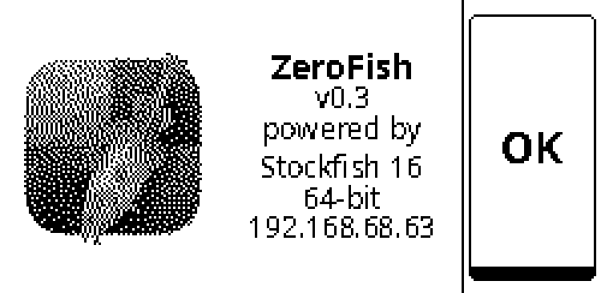

Startup screen. Shows the installed Stockfish version. Tap **OK** to begin, or **Cont** to resume an interrupted game.

### Difficulty selection
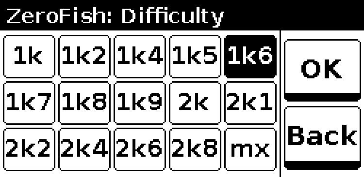

Tap a level (1k – ∞) to highlight it, then **OK**. Higher levels think longer and play stronger.

### Side selection
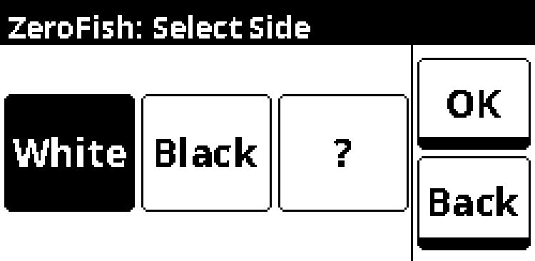

Choose **White**, **Black**, or **Random**. **Back** returns to difficulty selection.

### Thinking
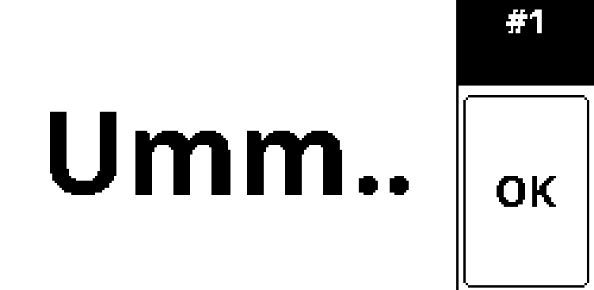

Shown while Stockfish calculates its reply.

### Engine move
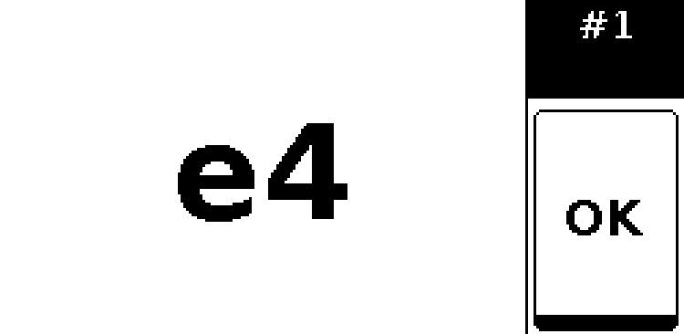

Stockfish's move displayed in large SAN notation. Make the move on the physical board, then tap **OK**.

### Player move input
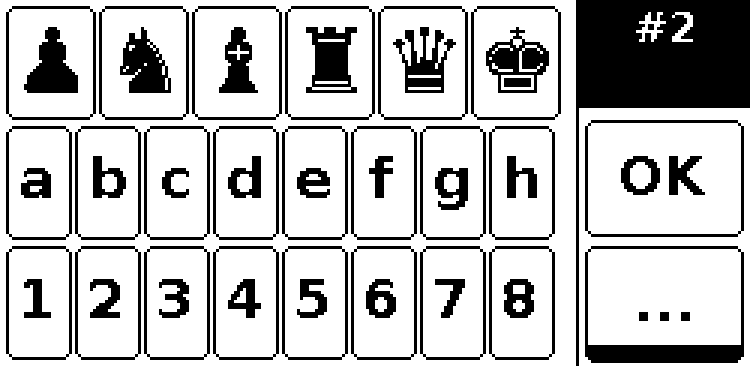

Three button rows: piece type (row 1), file a–h (row 2), rank 1–8 (row 3). **OK** becomes active once all three are selected. **More** opens the in-game menu.

### Pawn promotion
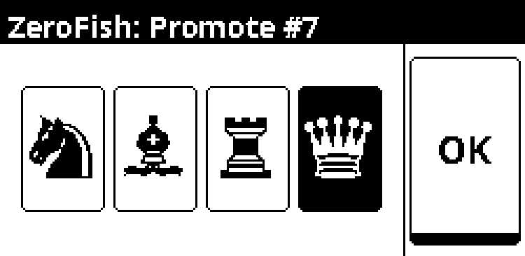

Appears when a pawn reaches the back rank. Tap the desired piece, then **OK**.

### Disambiguation
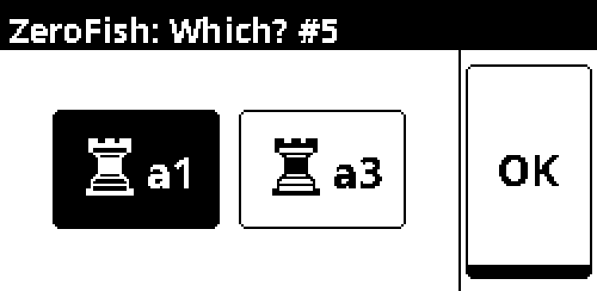

Shown when two pieces of the same type can legally reach the chosen square. Tap the source square to resolve.

### In-game menu
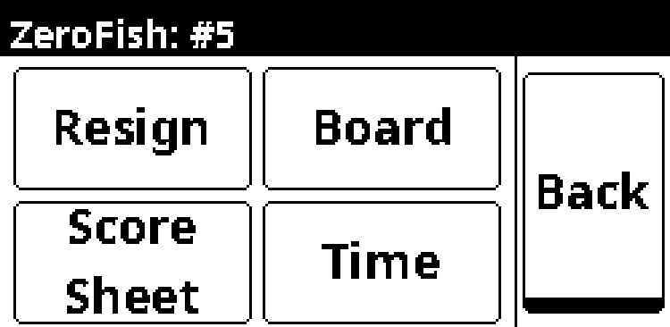

Accessible via **More** on the player move screen. Options: **Resign**, **Board** (position view), **Score Sheet**, **Time**. **Back** returns to move input.

### Resign confirm
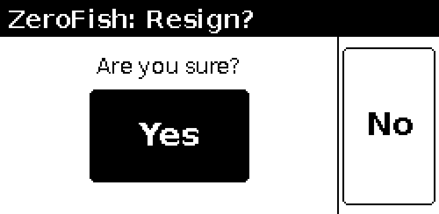

Confirmation dialog before forfeiting the game.

### Time
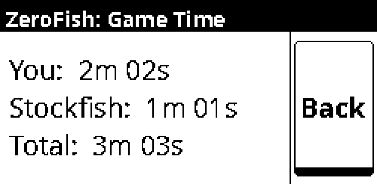

Elapsed time split between you, Stockfish, and the total game clock. **Back** returns to the menu.

### Board view
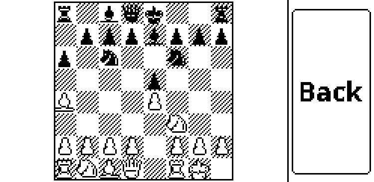

Current position from the player's perspective. Dark squares are hatched; white pieces are outlined. **Back** returns to the in-game menu.

### Score sheet
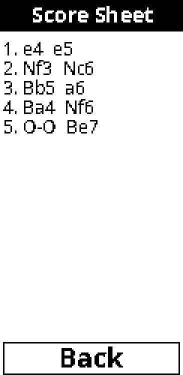

Portrait-orientation move list showing up to the last 15 full moves. **Back** returns to the in-game menu.

### Game over
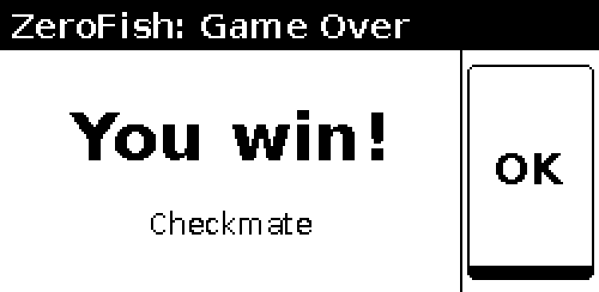

Result and termination reason. Tap **OK** to start a new game from the splash screen.

## Testing

### Unit tests (dev machine, no hardware)

Run the full unit suite locally. The `conftest.py` in `tests/` stubs out all RPi hardware, so no Pi is needed.

```bash
.venv/bin/python3 -m pytest tests/ --ignore=tests/rpi -v
```

The RPi integration tests auto-skip on a non-Pi machine — running without `--ignore` is safe but produces skips rather than runs.

### RPi integration tests (real hardware required)

The tests in `tests/rpi/` exercise the complete game loop on real e-ink hardware with a mock Stockfish engine (instant, deterministic first-legal-move replies) and injected touch events. They skip automatically on any machine that isn't a Raspberry Pi.

**Deploy the code first**, then SSH into the Pi and run pytest:

```bash
bash deploy/deploy.sh          # sync latest code to the Pi

ssh zero@192.168.68.59
cd ~/zerofish
pytest tests/rpi/ -v
```

The two tests covered:

| Test | What it exercises |
|------|-------------------|
| `test_new_game_white_resign` | New game as White → play 1.e4 → acknowledge Stockfish reply → open menu → resign → game over → splash |
| `test_resume_unfinished_game` | Pre-existing save file detected on startup → resume screen → select game → resign → game over → splash |

Each test starts `main.main()` in a background thread, injects touch events via a semaphore-synchronised queue, and blocks until the real e-ink display finishes each full refresh. pytest must be installed on the Pi:

```bash
pip3 install pytest --break-system-packages
```

## Project structure

```
zerofish/
  main.py              # full application — all screens and game loop
  game_state.py        # save/load/clear game state (Resume after power loss)
  boot_splash.py       # early-boot script: shows "Booting…" before main service starts
  ui.py                # shared layout, font cache, drawing helpers
  config.py            # all tunable constants: sizes, fonts, paths, idle timeout
  screen_*.py          # one module per screen
  TP_lib/              # WaveShare drivers (epd2in13_V4, gt1151, epdconfig)
deploy/
  deploy.sh            # rsync + service install/restart (run from dev machine)
  rpi_setup.sh         # first-time RPi setup: interfaces, packages, power tuning
  zerofish.service     # systemd unit — autorun on boot, restarts on failure
  zerofish-boot.service # early-boot splash service (runs before zerofish.service)
```

## Dev Notes

### GT1151 touch controller — don't write the config

`Screen_Touch_Level` at register `0x8053` reads `0xFA` (250) from the factory — already at the hardware maximum. Writing any value via the config block write corrupts the chip and makes it unresponsive until the next reset. Leave it alone.

Missed taps are a software race condition, not a hardware sensitivity issue. `irq_poll()` must be **set-only**: it raises `dev.Touch = 1` when INT is low but never clears it. `GT_Scan()` clears it after reading. If `irq_poll` clears `dev.Touch` back to 0 between the `had_irq` snapshot and the `GT_Scan` call, the event is silently dropped. The thread also needs a small sleep (5 ms) — without it, it runs as a busy loop pinning one CPU core at 100%.

### E-paper refresh strategy

Two refresh paths exist and must be used correctly:

- `displayPartBaseImage` — writes to **both** frame buffers simultaneously. Use this on every screen transition so the previous screen doesn't ghost through on the next partial update.
- `displayPartial_Wait` — fast in-screen update. Use for button tap feedback.
- Force a full `FULL_UPDATE` cycle every 5 partial updates to prevent ghost accumulation.

On every screen transition: `epd.init(FULL_UPDATE)` → `displayPartBaseImage` → `epd.init(PART_UPDATE)`.

### Coordinate systems

The PIL canvas is always 250 × 122 (landscape). `epd.getbuffer()` applies a 270° rotation internally before sending to the display. Hold the device with the USB port on the left.

Touch coordinates from the GT1151 arrive in portrait space and must be swapped:
```python
lx = 249 - ty   # landscape X
ly = tx          # landscape Y
```

The score sheet is an exception — it renders a 122 × 250 portrait image. `getbuffer()` rotates it 180° for display. Hold the device upright (USB at the bottom). No touch transform is needed in portrait mode; raw `(tx, ty)` map directly to PIL coordinates.

### CPU governor

`powersave` is active at all times except during Stockfish's think:
```python
_set_cpu_governor('performance')
result = engine.play(board, think_limit)
_set_cpu_governor('powersave')
```

This is done at both call sites. The helper script (`/usr/local/bin/zerofish-set-governor`) is whitelisted in sudoers so no password prompt is needed.

### Chess glyph font

Unicode chess symbols (♟♞♝♜♛♚) require a font with coverage at U+2654–U+265F. The code tries **Chess Merida Unicode** first (traditional figurines, manual install) then falls back to **DejaVu Sans** (confirmed working). The piece font path list (`config.FONT_PIECE_PATHS`) is separate from the regular font family system because glyph coverage matters more than style here.

## Possible next steps

- Bluetooth board integration (auto-detect moves)
