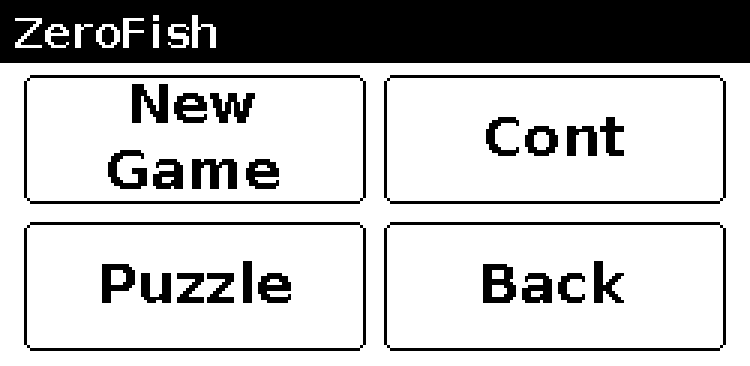
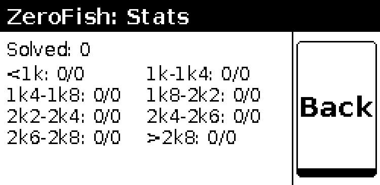
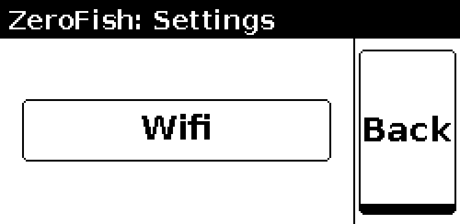
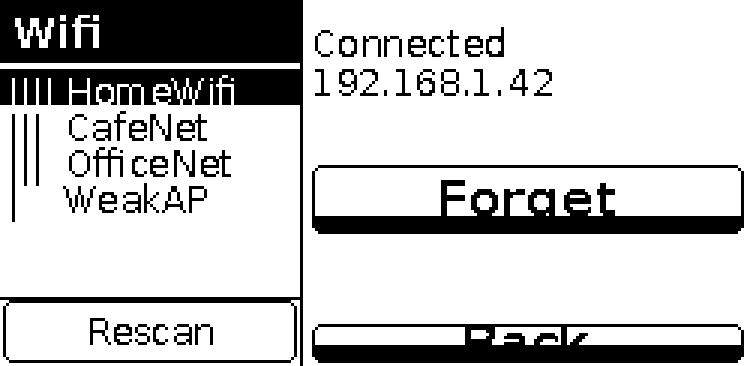
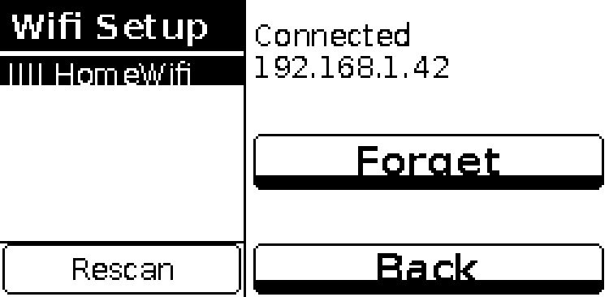
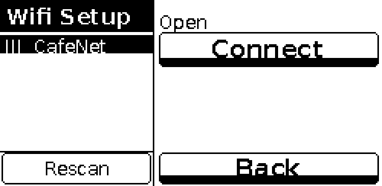
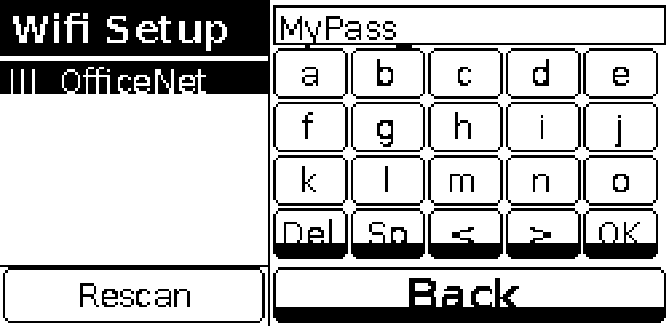
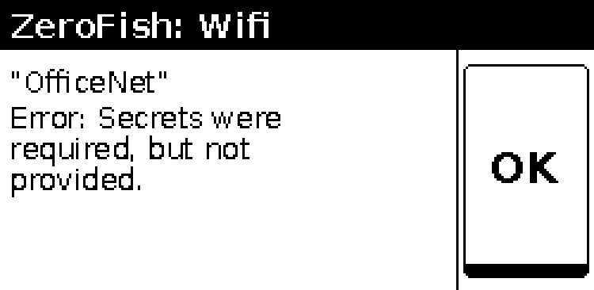

# ZeroFish

A standalone chess computer built on a Raspberry Pi Zero 2 W with a WaveShare 2.13" touch e-paper display. Stockfish runs as the engine; the player makes physical moves on a real board, then enters each move by tapping piece type and target square on the display.

**For setup, deployment, and technical internals see [DEVELOPER.md](DEVELOPER.md).**

---

Jump to: [Hardware](#hardware) · [English](#english) · [Deutsch](#deutsch) · [Français](#français) · [Español](#español) · [한국어](#한국어)

---

## Hardware

| Part | Where to buy |
|------|-------------|
| Raspberry Pi Zero 2 W | [Amazon](https://amzn.eu/d/0armY7FJ) |
| WaveShare 2.13" Touch e-Paper HAT V4 | [Amazon](https://amzn.eu/d/086WPCji) |
| Micro USB cable + USB power supply or power bank | — |
| Standard chess board | any physical board |

---

## Screenshots

All screens run at 250 × 122 px in landscape orientation (122 × 250 px for the score sheet).

### Splash

Startup screen. Shows the installed Stockfish version. Tap **OK** to reach the main menu, or **Cont** to resume an interrupted game.

### Main menu

Six buttons in a 3 × 2 grid: **New Game**, **Cont** (continue saved game), **Puzzle**, **Stats**, **Settings**, **Back** (return to splash).

### Stats

Total puzzles solved plus a per-difficulty breakdown across all eight Lichess rating bands. **Back** returns to the main menu.

### Settings

Currently contains a single **Wifi** button. **Back** returns to the main menu.

### WiFi setup — network list

Left panel: scrollable list of visible networks with signal-strength bars. Tap a network to select it. **Rescan** refreshes the list. Right panel adapts to the selected network (see below). **Back** returns to Settings.

### WiFi setup — connected network

The currently connected network is highlighted. Right panel shows **Connected**, the assigned IP address, and a **Forget** button. Tapping **Forget** disconnects, rescans, and shows **Disconnected**.

### WiFi setup — open network

Selecting a password-free network shows a **Connect** button in the right panel.

### WiFi setup — WPA keyboard

Selecting a WPA-protected network opens a password field and a 5 × 4 on-screen keyboard. **< >** cycle through six character pages (a–z, A–Z, 0–9, symbols). **Del** deletes one character, **Sp** inserts a space, **OK** submits.

### WiFi result

Shown when a connection attempt fails. Displays the SSID and the error message from nmcli. **OK** returns to the network list with the same network selected.

### Difficulty selection

Tap a level (1k – ∞) to highlight it, then **OK**. Higher levels think longer and play stronger.

### Puzzle difficulty selection

Before starting puzzles, choose a Lichess-rating band that matches your level. Eight bands are available: **&lt;1k**, **1k–1k4**, **1k4–1k8**, **1k8–2k2**, **2k2–2k4**, **2k4–2k6**, **2k6–2k8**, **&gt;2k8**. Tap a band to highlight it, then **OK**. **Back** returns to the main menu.

### Side selection

Choose **White**, **Black**, or **Random**. **Back** returns to difficulty selection.

### Thinking

Shown while Stockfish calculates its reply.

### Engine move

Stockfish's move displayed in large SAN notation. Make the move on the physical board, then tap **OK**.

### Player move input

Three button rows: piece type (row 1), file a–h (row 2), rank 1–8 (row 3). **OK** becomes active once all three are selected. **More** opens the in-game menu.

### Pawn promotion

Appears when a pawn reaches the back rank. Tap the desired piece, then **OK**.

### Disambiguation

Shown when two pieces of the same type can legally reach the chosen square. Tap the source square to resolve.

### In-game menu

Accessible via **More** on the player move screen. Options: **Resign**, **Board** (position view), **Score Sheet**, **Time**. **Back** returns to move input.

### Resign confirm

Confirmation dialog before forfeiting the game.

### Time

Elapsed time split between you, Stockfish, and the total game clock. **Back** returns to the menu.

### Board view

Current position from the player's perspective. Dark squares are hatched; white pieces are outlined. **Back** returns to the in-game menu.

### Puzzle screen

The board shows the puzzle position. The right panel header shows the puzzle number (e.g. **P#5**) and the current move within the sequence (e.g. **1/3** = first of three player moves). Rank numbers 1–8 are displayed to the right of the board so you can immediately see the board orientation. The side with rank 1 is White's home side.

Buttons: **Solve** (enter your move), **Skip** (skip to the next puzzle), **End** (return to the main menu).

### Score sheet

Portrait-orientation move list showing up to the last 15 full moves. **Back** returns to the in-game menu. When the game has more than 15 full moves a **More** button appears next to **Back**; each press scrolls back by 13 moves (overlapping the 2 oldest moves from the previous view for context). When move 1 is already visible, pressing **More** wraps back to the most recent moves.

### Game over

Result and termination reason. Tap **OK** to start a new game from the splash screen.

---

## English

ZeroFish is a standalone chess computer. Stockfish runs as the engine on a Raspberry Pi Zero 2 W; you play on any physical chess board. After each move — yours or the engine's — you enter it on the small touch e-paper display.

Hold the device landscape (short edge top/bottom, USB port on the left).

### Main menu

The main menu is a 3 × 2 grid:

| | Left | Right |
|---|---|---|
| Row 1 | **New Game** | **Cont** |
| Row 2 | **Puzzle** | **Stats** |
| Row 3 | **Settings** | **Back** |

**Stats** shows your solved-puzzle totals per Lichess difficulty band. **Settings** gives access to WiFi configuration.

### How to play

1. **Difficulty** — Tap one of 15 levels (1k – ∞) to choose engine strength, then **OK**. Level 1k plays at roughly 1000 Elo; ∞ uses Stockfish at full strength.
2. **Side** — Tap **White**, **Black**, or **Random**, then **OK**.
3. **Game loop:**
   - *Stockfish's turn:* The display shows its move in large SAN notation. Make the move on the physical board, then tap **OK**.
   - *Your turn:* Tap the three button rows — piece type (♟♞♝♜♛♚), file (a–h), rank (1–8) — then **OK**. If the combination is illegal the selection resets; the illegal-move count is shown in the title bar.
4. **Special moves:**
   - *Promotion:* When your pawn reaches the back rank a promotion screen appears. Tap the desired piece, then **OK**.
   - *Disambiguation:* If two pieces of the same type can reach the chosen square, a disambiguation screen appears. Tap the source square.
5. **In-game menu:** Tap **More** on the player-move screen to reach **Resign**, **Board** (position view), **Score Sheet**, and **Time**.
6. **Game over:** When the game ends for any reason (checkmate, stalemate, draw) a result screen appears. Tap **OK** to start a new game from the difficulty selection.

### WiFi

Tap **Settings → Wifi** to manage the wireless connection. The left panel lists visible networks (tap to select, **Rescan** to refresh). The right panel shows connection status and action buttons:

- **Connected network** — shows the IP address and a **Forget** button.
- **Open network** — shows a **Connect** button.
- **WPA/WPA2 network** — shows a password keyboard; use **< >** to cycle character pages, **OK** to connect.

If connection fails, an error screen shows the nmcli message. **OK** returns to the network list.

### Puzzles

Tap **Puzzles** on the main menu to train with Lichess tactical puzzles.

1. **Puzzle difficulty** — Choose a Lichess-rating band that matches your current strength. Eight ranges are available: **&lt;1k**, **1k–1k4**, **1k4–1k8**, **1k8–2k2**, **2k2–2k4**, **2k4–2k6**, **2k6–2k8**, **&gt;2k8**. Tap one to highlight it, then **OK**.
2. **Puzzle screen** — The board shows the position after the opponent's trigger move has already been played. The header shows **P#n** (puzzle number) and **m/M** (current player move out of total player moves). Rank numbers 1–8 appear to the right of the board so you can see which side is White (rank 1 = White's back rank).
3. **Solving** — Tap **Solve** to enter your move using the same piece / file / rank grid as in a normal game. If your move is correct and the puzzle has more moves, the engine's response is applied automatically and the counter advances (e.g. 1/3 → 2/3). A wrong move resets the board to the start of the puzzle so you can retry. A fully solved puzzle is never shown again.
4. **Skip / End** — Tap **Skip** to pass to the next puzzle without marking it solved. Tap **End** to finish the puzzle session and return to the main menu.
5. **Puzzle download** — Puzzles are downloaded automatically from the Lichess database in the background when an internet connection is available. If no puzzles have been downloaded yet, a loading screen is shown instead.

---

## Deutsch

ZeroFish ist ein eigenständiger Schachcomputer. Stockfish läuft als Engine auf einem Raspberry Pi Zero 2 W; gespielt wird auf einem beliebigen physischen Schachbrett. Nach jedem Zug — Ihrem oder dem der Engine — wird er auf dem kleinen Touch-E-Ink-Display eingegeben.

Das Gerät im Querformat halten (kurze Kante oben/unten, USB-Anschluss links).

### Spielanleitung

1. **Schwierigkeitsgrad** — Tippen Sie auf einen der 15 Level (1k – ∞), um die Stärke der Engine zu wählen, dann **OK**. Level 1k entspricht etwa 1000 Elo; ∞ nutzt Stockfish in voller Stärke.
2. **Seite** — Tippen Sie auf **Weiß**, **Schwarz** oder **Zufällig**, dann **OK**.
3. **Spielablauf:**
   - *Zug von Stockfish:* Das Display zeigt den Zug in großer SAN-Notation. Führen Sie den Zug auf dem physischen Brett aus und tippen Sie dann **OK**.
   - *Ihr Zug:* Tippen Sie auf die drei Schaltflächenreihen — Figurentyp (♟♞♝♜♛♚), Spalte (a–h), Reihe (1–8) — dann **OK**. Bei einem unzulässigen Zug wird die Auswahl zurückgesetzt; die Anzahl ungültiger Züge erscheint in der Titelleiste.
4. **Spezielle Züge:**
   - *Umwandlung:* Wenn Ihr Bauer die letzte Reihe erreicht, erscheint ein Umwandlungsbildschirm. Wählen Sie die gewünschte Figur und tippen Sie **OK**.
   - *Disambiguierung:* Falls zwei gleichartige Figuren das gewählte Feld erreichen können, erscheint ein Auswahlbildschirm. Tippen Sie auf das Ausgangsfeld.
5. **Spielmenü:** Tippen Sie auf **More** im Eingabebildschirm, um zu **Aufgeben**, **Brett** (Positionsansicht), **Spielblatt** und **Zeit** zu gelangen.
6. **Spielende:** Wenn das Spiel endet (Schachmatt, Patt, Remis), erscheint ein Ergebnisbildschirm. Tippen Sie **OK**, um ein neues Spiel ab der Schwierigkeitsauswahl zu starten.

### Aufgaben (Puzzles)

Tippen Sie im Hauptmenü auf **Puzzles**. Wählen Sie einen Lichess-Ratingbereich (**&lt;1k** bis **&gt;2k8**), dann **OK**. Der Titelbereich zeigt die Aufgabennummer (**P#n**) und den aktuellen Zug (**m/M**). Die Rangzahlen 1–8 rechts vom Brett zeigen die Brettausrichtung: Reihe 1 ist die weiße Grundreihe.

*Screenshots siehe [oben](#screenshots).*

---

## Français

ZeroFish est un ordinateur d'échecs autonome. Stockfish tourne comme moteur sur un Raspberry Pi Zero 2 W ; la partie se joue sur n'importe quel échiquier physique. Après chaque coup — le vôtre ou celui du moteur — vous le saisissez sur le petit écran e-paper tactile.

Tenez l'appareil en mode paysage (bord court en haut/bas, port USB à gauche).

### Comment jouer

1. **Difficulté** — Appuyez sur l'un des 15 niveaux (1k – ∞) pour choisir la force du moteur, puis **OK**. Le niveau 1k correspond à environ 1000 Elo ; ∞ utilise Stockfish à pleine puissance.
2. **Camp** — Appuyez sur **Blanc**, **Noir** ou **Aléatoire**, puis **OK**.
3. **Déroulement de la partie :**
   - *Tour de Stockfish :* L'écran affiche son coup en grande notation SAN. Effectuez le coup sur l'échiquier physique, puis appuyez sur **OK**.
   - *Votre tour :* Appuyez sur les trois rangées de boutons — type de pièce (♟♞♝♜♛♚), colonne (a–h), rangée (1–8) — puis **OK**. Si la combinaison est illégale, la sélection se réinitialise ; le nombre de coups illégaux s'affiche dans la barre de titre.
4. **Coups spéciaux :**
   - *Promotion :* Quand votre pion atteint la dernière rangée, un écran de promotion apparaît. Appuyez sur la pièce souhaitée, puis **OK**.
   - *Désambiguïsation :* Si deux pièces du même type peuvent atteindre la case choisie, un écran de désambiguïsation apparaît. Appuyez sur la case de départ.
5. **Menu en jeu :** Appuyez sur **More** depuis l'écran de saisie pour accéder à **Abandonner**, **Échiquier** (vue de la position), **Feuille de partie** et **Temps**.
6. **Fin de partie :** Quand la partie se termine (échec et mat, pat, nulle), un écran de résultat apparaît. Appuyez sur **OK** pour commencer une nouvelle partie depuis la sélection de difficulté.

### Puzzles

Appuyez sur **Puzzles** dans le menu principal. Choisissez une plage de classement Lichess (**&lt;1k** à **&gt;2k8**), puis **OK**. L'en-tête affiche le numéro du puzzle (**P#n**) et le coup en cours (**m/M**). Les chiffres de rangée 1–8 à droite de l'échiquier indiquent l'orientation : la rangée 1 est la rangée de base des Blancs.

*Captures d'écran : voir [ci-dessus](#screenshots).*

---

## Español

ZeroFish es una computadora de ajedrez autónoma. Stockfish funciona como motor en una Raspberry Pi Zero 2 W; la partida se juega en cualquier tablero físico. Después de cada movimiento — tuyo o del motor — lo introduces en la pequeña pantalla e-paper táctil.

Sostén el dispositivo en horizontal (borde corto arriba/abajo, puerto USB a la izquierda).

### Cómo jugar

1. **Dificultad** — Toca uno de los 15 niveles (1k – ∞) para elegir la fuerza del motor, luego **OK**. El nivel 1k equivale a aproximadamente 1000 Elo; ∞ usa Stockfish a plena potencia.
2. **Lado** — Toca **Blancas**, **Negras** o **Aleatorio**, luego **OK**.
3. **Ciclo de juego:**
   - *Turno de Stockfish:* La pantalla muestra su movimiento en notación SAN grande. Realiza el movimiento en el tablero físico, luego toca **OK**.
   - *Tu turno:* Toca las tres filas de botones — tipo de pieza (♟♞♝♜♛♚), columna (a–h), fila (1–8) — luego **OK**. Si la combinación es ilegal, la selección se reinicia; el conteo de movimientos ilegales se muestra en la barra de título.
4. **Movimientos especiales:**
   - *Promoción:* Cuando tu peón llega a la última fila, aparece una pantalla de promoción. Toca la pieza deseada, luego **OK**.
   - *Desambiguación:* Si dos piezas del mismo tipo pueden alcanzar la casilla elegida, aparece una pantalla de desambiguación. Toca la casilla de origen.
5. **Menú en partida:** Toca **More** en la pantalla de entrada para acceder a **Rendirse**, **Tablero** (vista de posición), **Planilla** y **Tiempo**.
6. **Fin del juego:** Cuando la partida termina (jaque mate, tablas, empate), aparece una pantalla de resultado. Toca **OK** para comenzar una nueva partida desde la selección de dificultad.

### Puzzles

Toca **Puzzles** en el menú principal. Elige un rango de puntuación Lichess (**&lt;1k** a **&gt;2k8**), luego **OK**. El encabezado muestra el número del puzzle (**P#n**) y el movimiento actual (**m/M**). Los números de fila 1–8 a la derecha del tablero indican la orientación: la fila 1 es la fila base de las Blancas.

*Capturas de pantalla: ver [arriba](#screenshots).*

---

## 한국어

ZeroFish는 독립형 체스 컴퓨터입니다. Stockfish가 Raspberry Pi Zero 2 W에서 엔진으로 실행되며, 실제 체스판에서 게임을 진행합니다. 각 수를 두고 나면 — 당신의 수든 엔진의 수든 — 작은 터치 전자잉크 디스플레이에 입력합니다.

기기를 가로 방향으로 잡으세요 (짧은 면이 위/아래, USB 포트가 왼쪽).

### 게임 방법

1. **난이도** — 15개 레벨 중 하나(1k – ∞)를 탭하여 엔진 강도를 선택한 후 **OK**. 레벨 1k는 약 1000 Elo에 해당하며, ∞는 Stockfish 최대 강도를 사용합니다.
2. **진영** — **백**, **흑** 또는 **랜덤**을 탭한 후 **OK**.
3. **게임 진행:**
   - *Stockfish의 차례:* 디스플레이에 큰 SAN 표기법으로 수가 표시됩니다. 실제 체스판에서 해당 수를 두고 **OK**를 탭하세요.
   - *당신의 차례:* 세 줄의 버튼을 탭하세요 — 기물 종류(♟♞♝♜♛♚), 열(a–h), 행(1–8) — 그런 다음 **OK**. 조합이 불법이면 선택이 초기화됩니다; 불법 수 횟수가 타이틀 바에 표시됩니다.
4. **특수 수:**
   - *프로모션:* 폰이 마지막 행에 도달하면 프로모션 화면이 나타납니다. 원하는 기물을 탭한 후 **OK**.
   - *중의성 해소:* 같은 종류의 기물 두 개가 선택한 칸에 도달할 수 있는 경우 중의성 해소 화면이 나타납니다. 출발 칸을 탭하세요.
5. **게임 중 메뉴:** 기물 입력 화면에서 **More**를 탭하면 **기권**, **보드** (포지션 보기), **기보**, **시간** 메뉴에 접근할 수 있습니다.
6. **게임 종료:** 게임이 끝나면 (체크메이트, 스테일메이트, 무승부) 결과 화면이 나타납니다. **OK**를 탭하여 난이도 선택부터 새 게임을 시작하세요.

### 퍼즐

메인 메뉴에서 **Puzzles**를 탭하세요. Lichess 레이팅 범위(**&lt;1k** ~ **&gt;2k8**)를 선택한 후 **OK**. 헤더에는 퍼즐 번호(**P#n**)와 현재 수(**m/M**)가 표시됩니다. 보드 오른쪽의 1–8 행 번호로 방향을 확인할 수 있으며, 1행이 백의 뒷줄입니다.

*스크린샷은 [위](#screenshots)를 참조하세요.*
